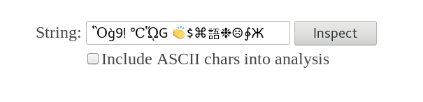
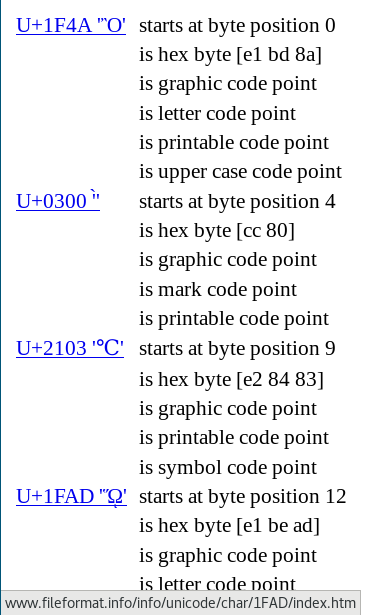

# inspectorString
Inspect and analyze the utf-8 (unicode) code points of a string.

When dealing with unicode strings on the web, one can encounters odd
behavior of the strings when they are further processed. More often then
not, a unicode code point is responsible (different white spaces, dashes,
etc).

Inspector String analyses the string and breaks it apart into its
constituent code points offering a link with further information to each
code point.

Let's have fun with
```
Ὂg̀9! ℃ᾭG 👏$⌘語❉☹∳Ж
```




## Usage

```
$ inspectorString
```
starts the inspector as a web service that runs on `localhost:8080`. Per
default simple ASCII characters are omitted in the analysis.

```
$ inspectorString -browser -port=":7070"
```
starts the web service on port `:7070` and automatically opens a browser
with a tab on that port.

## Build

```
go get -u github.com/frankMilde/inspectorString
go get -u github.com/go-zoo/bone
```

The binary was statically linked using

```
go build -ldflags "-linkmode external -extldflags -static"
```

## References

This little service is mostly inspired by golangs excellent `unicode`
[package](https://golang.org/pkg/unicode/) and the blog post
[Strings, bytes, runes and characters in Go](https://blog.golang.org/strings)
